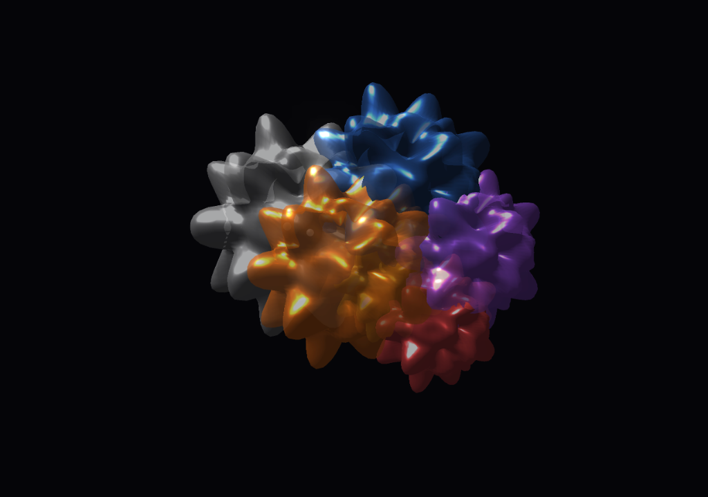
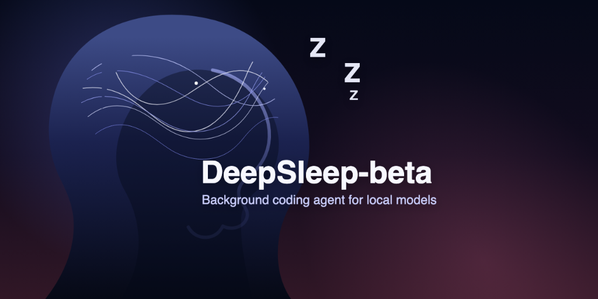
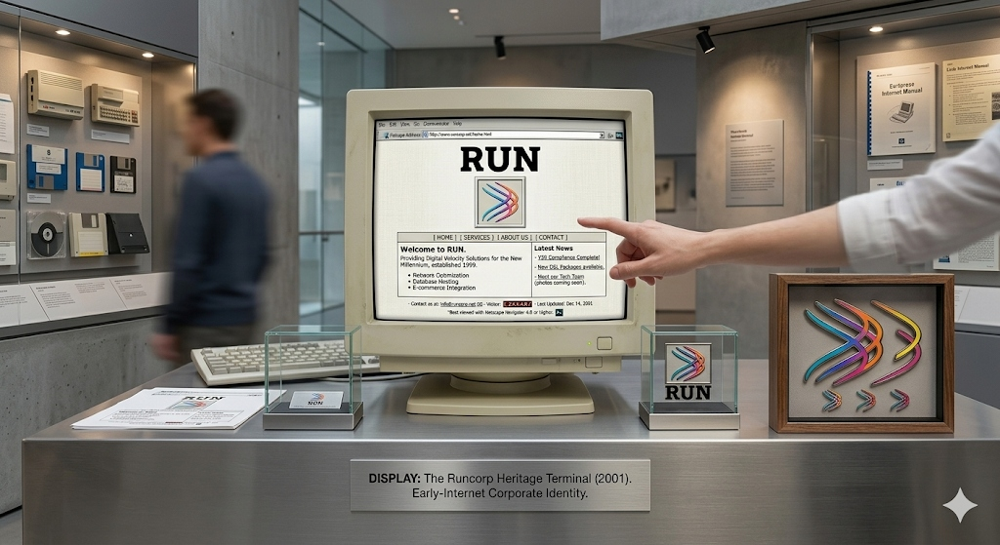

# 0xKeshav / Keshav Sharma

---

## 🚀 About Me
- 🛠️ Building **the first cinematic 3D memory layer** for the AI Era.
- 🧠 Architecting **autonomous local coding agents** that dream and optimize.
- 🎙️ Designing **deliberate voice-controlled computer automation**.
- 🤝 Open to collaborating on **low-level optimization** and AI infrastructure.

---

## 🌟 Main Works

### 🧠 DeepSleep Hub
*The first cinematic 3D memory layer for the AI Era.*

> Unify ChatGPT, Claude, and Gemini into a pulsing second brain with real-time semantic extraction and 3D visualization.

---

### 🐣 DeepSleep-beta
*Autonomous coding agents that dream while you sleep.*

> A 100% local, 100% free autonomous agent that optimizes your code sitting idle, using a 3-layer memory architecture.

---

### 🎙️ Run
*Voice-controlled computer automation that asks before acting.*

> Local, private, and deliberate computer control. Say it. It runs. Built for speed and privacy.

---

## 🛠️ Tech Stack

  
  
  
  
  
  
  
  

